### آزمایش Profiling
#### محمدحسین علی‌حسینی - ۹۹۱۰۱۹۲۱ - PO
#### فخرالدین عبدی - ۹۹۱۰۶۴۵۸

### بخش اول
طبق گزارش Yourkit، مصرف منابع برای کلاس اجرایی `JavaCup` به‌شرح زیر است:
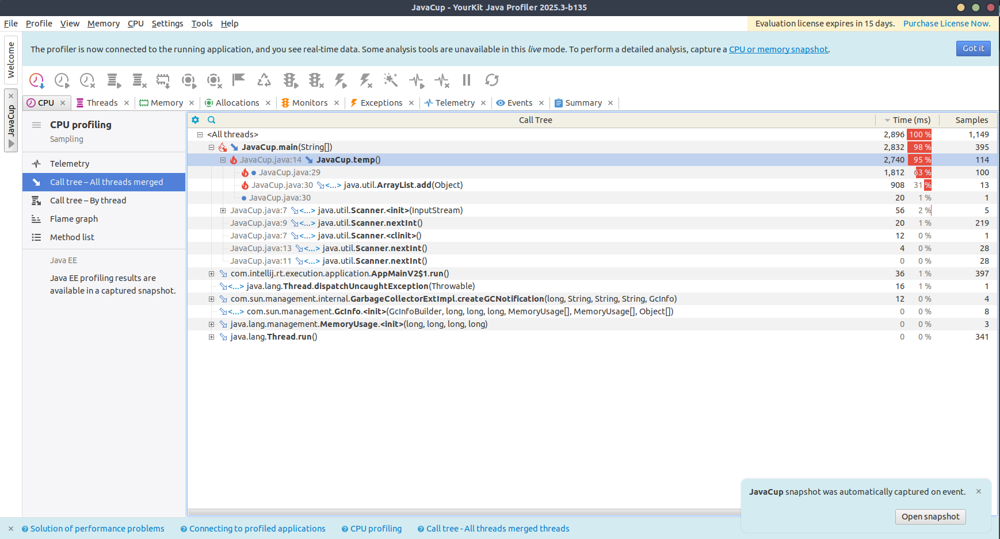
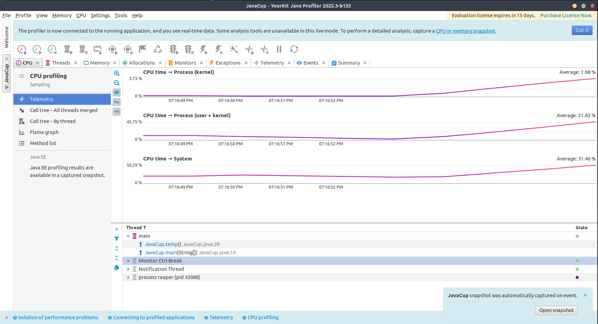
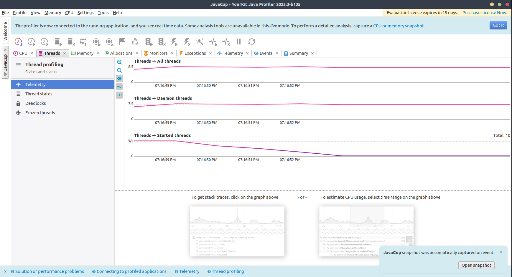
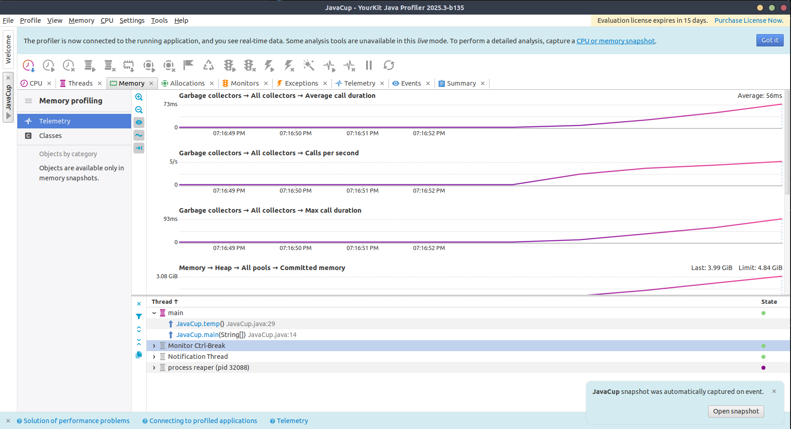

برنامه در زمان زیادی ($O(n^2)$) اجرا می‌شود که به‌دلیل resize شدن‌های زیاد و عدم فیکس بودن سایز، حافظه زیادی نیز استفاده می‌کند.

با تغییر کد تابع `temp` که طبق نتیجه Profiling بیشترین مصرف منابع را دارد، به نمودارهای زیر می‌رسیم.
```java
public static void temp() {
final int totalSize = 10000 * 20000;
    int[] array = new int[totalSize];
    int index = 0;

    for (int i = 0; i < 10000; i++) {
        for (int j = 0; j < 20000; j++) {
            array[index++] = i + j;
        }
    }
}
```

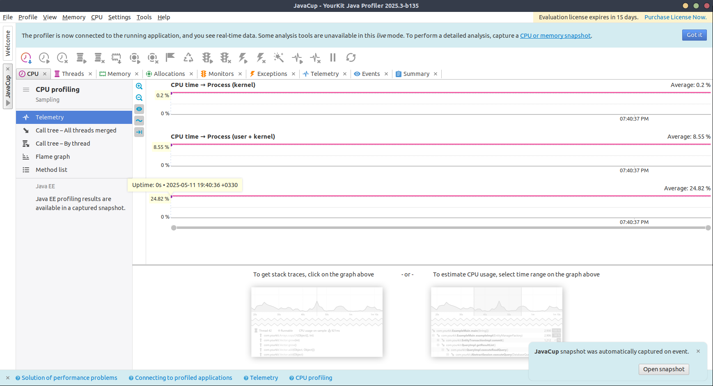
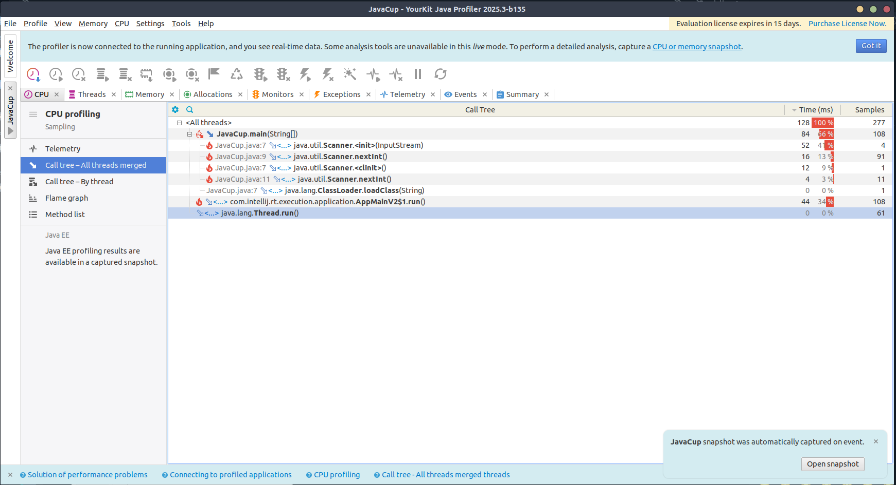
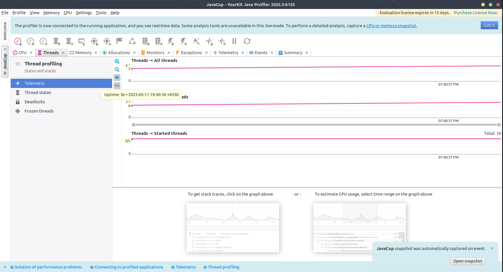
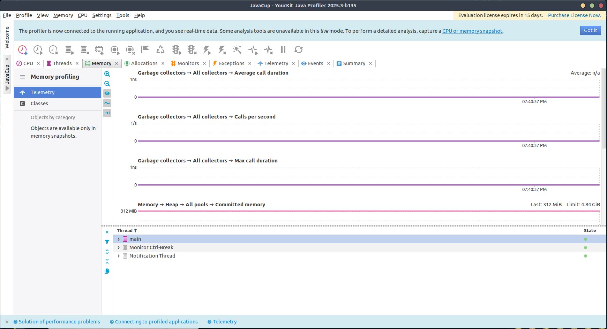

به‌شکل قابل ملاحظه‌ای، مصرف `CPU` و `Memory` و همچنین زمان اجرای برنامه کاهش یافته است؛ زیرا نیاز به resize آرایه نیست و اندازه آن در زمان `compile` فیکس شده است.

### بخش دوم
`ProfilingTest/src/PrimeFinder.java`

کد توسعه داده‌شده در این بخش، اعداد اول کوچکتر از متغیر `limit` را محاسبه و چاپ می‌کند. در حالت غیربهینه، زمان اجرای برنامه از مرتبه $O(n^2)$ می‌باشد.

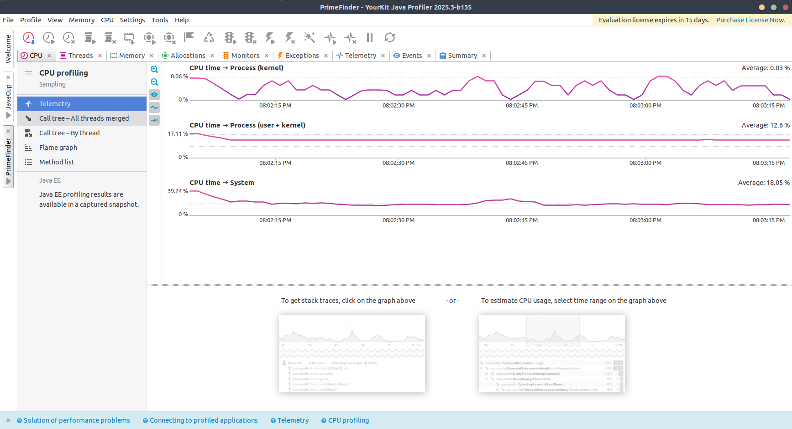
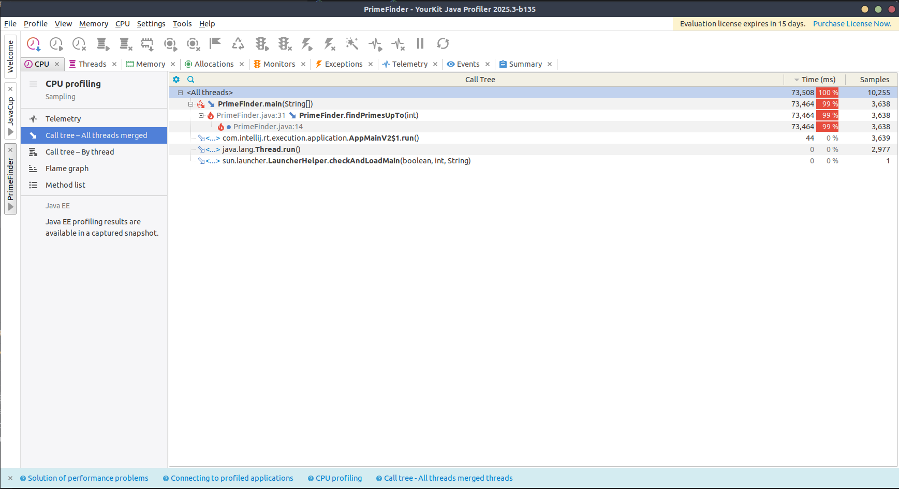
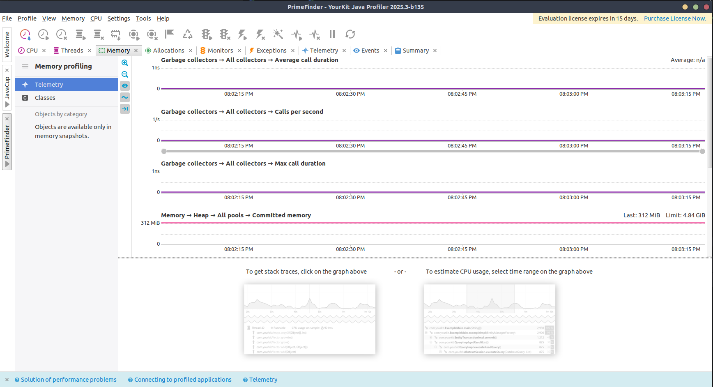

با بهبود زمان اجرا و الگوریتم محاسبه، زمان اجرا به $O(nlog(log(n)))$ عملکرد برنامه بهتر شده و زمان اجرا و مصرف `CPU` کاهش یافته است.

```java
// Sieve algorithm
for (int i = 2; i * i <= limit; i++) {
    if (isPrime[i]) {
        for (int j = i * i; j <= limit; j += i) {
            isPrime[j] = false;
        }
    }
}
```

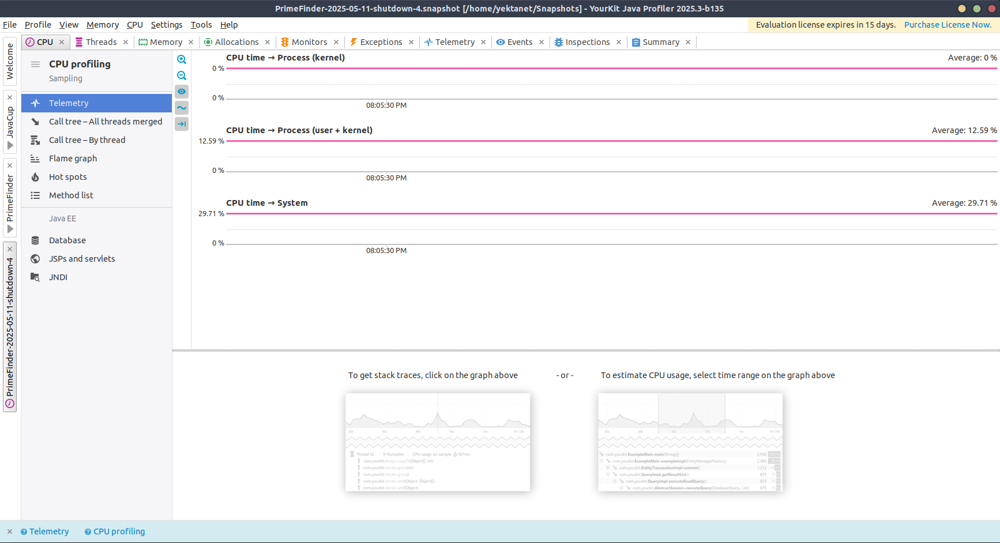
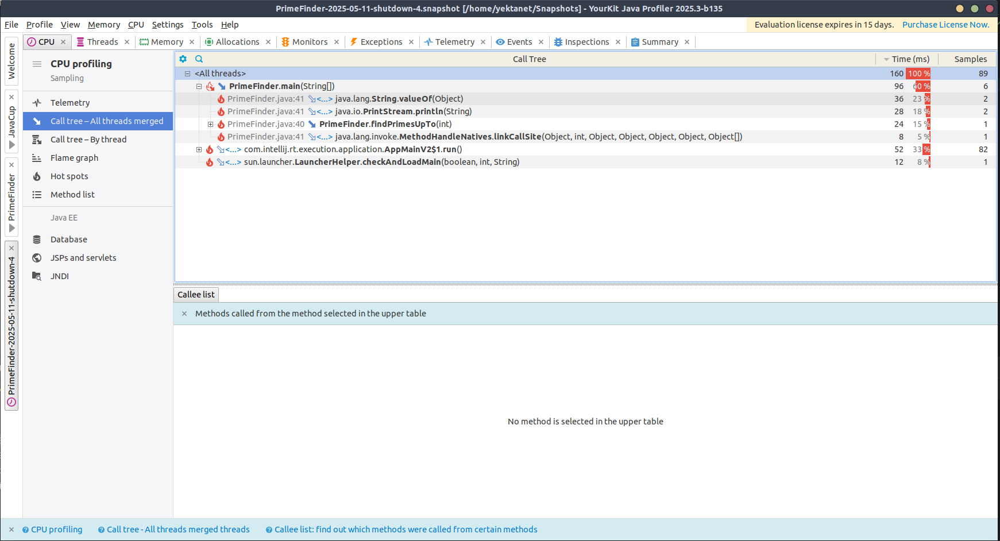
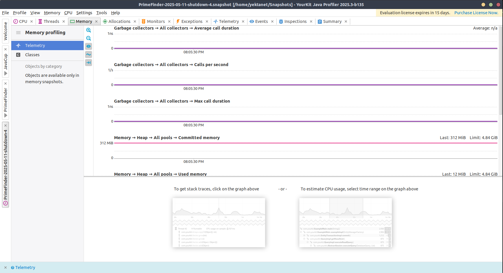
